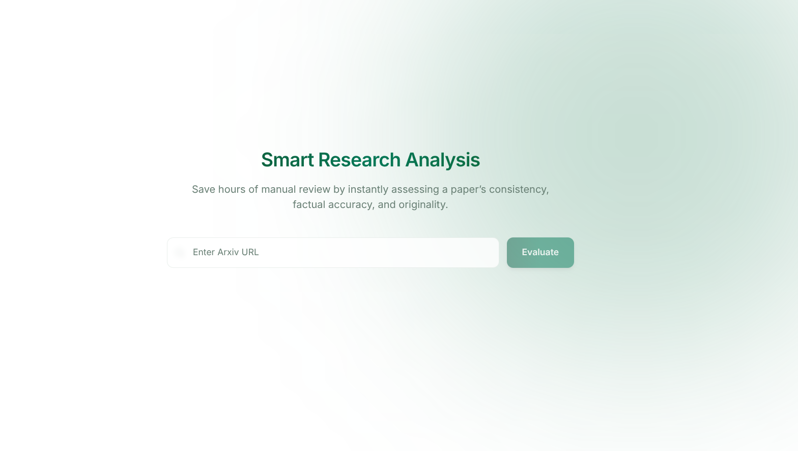

# 🧠 ScholarMate AI - Agentic Research Paper Evaluator

An intelligent multi-agent system that automatically evaluates research papers from arXiv for **quality, consistency, novelty, factual accuracy, and authenticity**.




## 🚀 Problem

The academic community and independent researchers are often overwhelmed by the sheer volume of papers published on platforms like arXiv.

Manually verifying:
- internal consistency  
- factual correctness  
- novelty  
- writing quality  

is **time-consuming and error-prone**.

## 💡 Solution

This project uses a **multi-agent architecture powered by LangGraph** to simulate a structured peer-review process.

Each agent specializes in a specific aspect of evaluation, working in parallel to produce a comprehensive report.


## ⚙️ Features

### 🔍 Automated Paper Analysis
- Input: arXiv URL  
- Output: Structured evaluation report  


### 🧠 Multi-Agent Evaluation

| Agent | Function |
|------|--------|
| ✍️ Grammar Agent | Evaluates writing quality |
| 📊 Consistency Agent | Checks methodology vs results |
| 🔎 Fact-Check Agent | Verifies factual claims |
| 🛡️ Authenticity Agent | Detects fabrication risk |
| 💡 Novelty Agent | Assesses originality |


### 📄 Report Generation
- Executive summary  
- Pass / Fail recommendation  
- Structured metrics  (authenticity, consistency, grammar rating, novelty, fact-checking)
- Downloadable PDF report  

### ⚡ Modern UI
- Built with React + Tailwind  
- Live agent activity visualization  
- Clean, readable report layout  


## 🏗️ Architecture

User Input (arXiv URL)
  ↓
Scraper (ar5iv HTML)
  ↓
LangGraph Orchestrator
  ↓
Parallel Agents
  ↓
Synthesizer Agent
  ↓
Report (UI + PDF)


## 🧰 Tech Stack

| Layer | Tech |
|------|-----|
| Agent Framework | LangGraph |
| Backend | FastAPI |
| Frontend | React + Tailwind |
| LLM | OpenRouter Models |
| Scraping | BeautifulSoup |
| Embeddings | sentence-transformers |
| Vector DB | FAISS |
| PDF | HTML → Browser |


## 📦 Installation

### 1. Clone repo

```bash
git clone [https://github.com/siddhartharishi/ScholarMate-AI.git]
cd ScholarMate-AI
````


### 2. Backend setup

```bash
python -m venv venv # create virtual env
source venv/bin/activate # activate
pip install -r requirements.txt
```

Create `.env`:

```env
OPENROUTER_API_KEY=your_key
SERPAPI_KEY=your_key
```

Run server:

```bash
cd backend
uvicorn app:app --reload
```


### 3. Frontend setup

```bash
cd frontend
npm install
npm run dev
```


## 🧪 Usage

1. Open UI
2. Paste arXiv URL (e.g. `[https://arxiv.org/pdf/1706.03762]`)
3. Click **Evaluate**
4. View results
5. Download PDF report


## 📊 Example Output

* ✅ Consistency Score
* 🟡 Grammar Rating
* 🔴 Authenticity Risk
* 💡 Novelty Explanation
* ✔ Verified Claims

## ⚠️ Limitations

* Fact-checking relies on web search (not always authoritative)
* Novelty detection is heuristic (not citation-level)
* Authenticity score is probabilistic
*  Currently, using LLM as Judge to give score, which might not be a effective.


## 🔮 Future Improvements

* Claim-level novelty detection
* Citation graph analysis
* Real-time agent streaming
* Better formulation to calculate metrics


